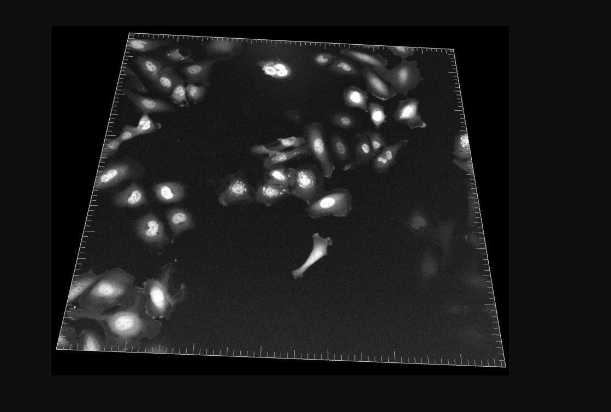
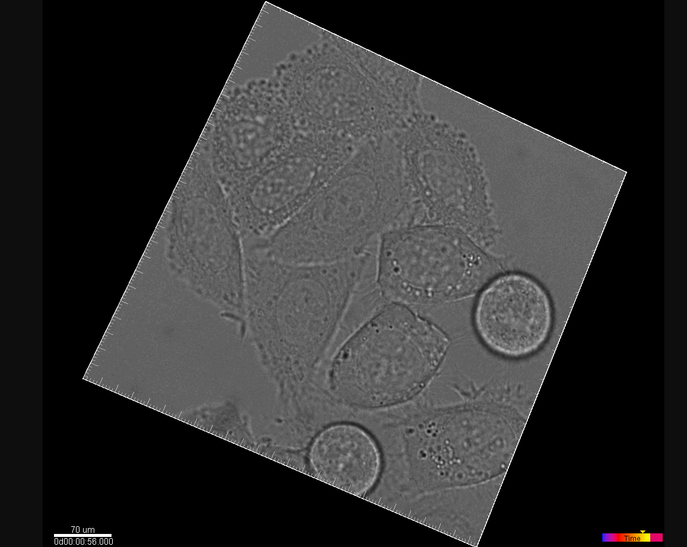
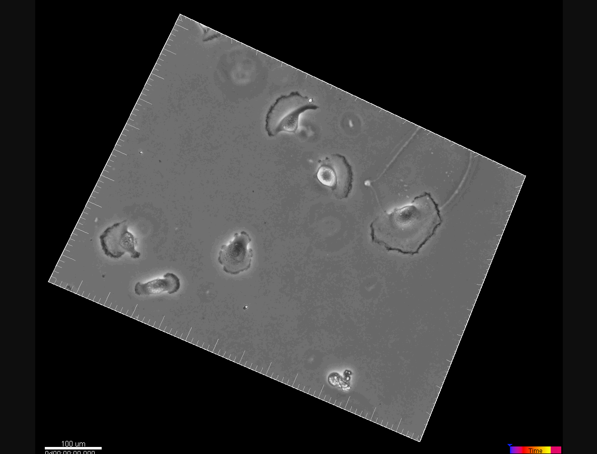
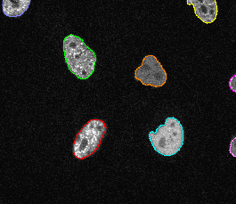

* **project goal** - *CNN for segmenting cells in microscopy images*

## notes

* input size == output_size
* data from *fluorescence*, *differencial interference contrast*, *phase-contrast microscopy*
* models trained on single modalities + model trained on all modalities
* use 2D Unet as basis
* experiment with different network configs
* losses: cross_entropy  / dice loss / both
* more info datasets: https://celltrackingchallenge.net/

## datasets
* each dataset consists of two image sequences
* silver truth in `01_ST/SEG`
* one sequence - training, second sequence testing (misha: why not use test set from repo ?)

# training + evaluation
* compare different networks for each modality
* eval: jaccard index
## modalities

* **fluo**  
    

* **DIC**  
    

* *phase-contrast*
    
* **segmented**
    